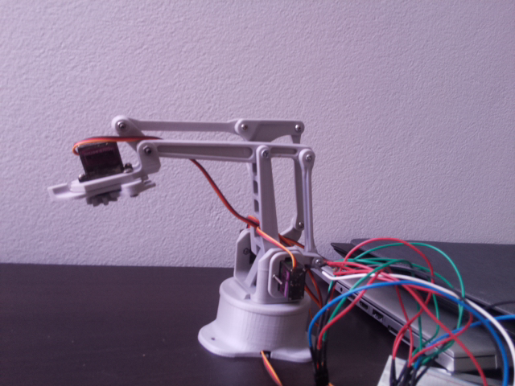

# Overview

This is a home project (and work in progress) that uses a raspberry pi as a modular, portable data collection device with a touch screen GUI.

Using the 'snap' and 'collect' buttons in the touch screen gui, the application instantly collects data which is then automatically recorded into an excel spreadsheet (a new file for each day).

# Setup

To get this base application installed, ensure you have installed the necessary hardware (rpi zero, 3.5inch LCD touchscreen, rpi camera) and clone this repo onto the desktop of your raspberry pi. This application also relies on the following dependencies (which need to be pip installed):

* tkinter
* pillow
* ip2geolocation
* picamera

Once the repo has been cloned and the dependencies have been installed, click on the new 'Data Collect' desktop icon to open the application.

Collecting data will lead to a dated output.csv file in the [output](gui_apps/output) directory with corresponding image files in the [output/imgs](gui_apps/output/imgs) directory, and will look something like this:

Photo taken with collect - 20210210172906_rpilog_img.png

# Notes

At the moment, the raspberry pi device is only setup to collect pictures from an installed camera, along with location information based on the IP address of the raspberry pi's internet connection point, and a timestamp.

The next iteration will include temperature and humidity sensors, and a gps reciever to obtain more accurate location data.
